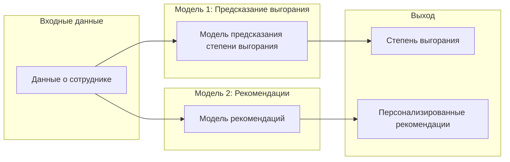

# Prediction-employee-burnout

---

## 🐘Слон: Система предсказания выгорания сотрудников

**Помогаем сотрудникам быть счастливыми и продуктивными**

### Введение

Проект "Слон" - это инновационная система, которая помогает организациям бороться с профессиональным выгоранием сотрудников.  Мы разработали "Слона" для раннего выявления факторов риска выгорания и предоставления персонализированных рекомендаций по его предотвращению.

### Проблема

Профессиональное выгорание - это серьезная проблема, которая приводит к снижению производительности труда, повышению уровня стресса и ухудшению  общего благополучия сотрудников. 

### Решение

"Слон" использует двухступенчатый подход:

1. **Предсказание степени выгорания:** 
   * Первая модель использует современные методы машинного обучения, чтобы максимально точно оценить риск выгорания сотрудника. А имеено градиентный бустинг на XGBoost.

2. **Персонализированные рекомендации:**
   * Вторая модель, основываясь на результатах первой модели и входных данных, предлагает индивидуальные советы по различным направлениям

### Преимущества

* **Раннее выявление:**  "Слон" позволяет своевременно выявлять  факторы риска и предпринимать меры по предотвращению выгорания.
* **Точность:**  Высокая точность предсказания за счет анализа кореляции параметров, вклада каждой фичи на выгорание и анализ факторов выгорания со всего мира.
* **Персонализированные рекомендации:**  Система генерирует индивидуальные рекомендации, адаптированные к  конкретному  сотруднику.

###  Технологии

Проект "Слон" реализован на Python с использованием:
* Keras
* Tensorflow
* Shap
* Flask
* А также множеством вспомогательный библиотек на подобии Pandas, Numpy и т.д.

###  Схема работы "Слона"



##  Данные
В качестве исходных данных использовался датасет IBM о сотрудниках за 2016 год. Этот датасет содержит информацию о различных аспектах жизни и работы сотрудников, что позволяет построить комплексную модель предсказания.

## Процесс разработки

### Анализ данных
На первом этапе был проведен тщательный анализ предоставленного датасета, включающий в себя:

Очистку данных: Обработка пропущенных значений и выбросов.
Исследовательский анализ данных (EDA): Визуализация распределения данных, выявление корреляций между переменными.
Построение корреляционной матрицы: Определение взаимосвязей между различными факторами, влияющими на выгорание.


### Моделирование предсказания выгорания
Для предсказания выгорания была построена бинарная классификационная модель. Выбор конкретной архитектуры и его гиперпараметров осуществлялся на основе кросс-валидации и метрик качества модели (например, точность и F1-score).

#### Что за модели?
Снчала мы использовали обычную MLP модель несколькими скрытыми слоями и дропаутом. В модели использовалась ранняя остановка за счет точности валидационного набора, поэтому далее будет показан лог *лучшей* эпохи, а также метрики для тестового набора.

```
Epoch 44/100
1805/1805 ━━━━━━━━━━━━━━━━━━━━ 2s 932us/step - accuracy: 0.9846 - f1_score: 0.6958 - loss: 0.0562 - val_accuracy: 0.9812 - val_f1_score: 0.6792 - val_loss: 0.0910

accuracy: 0.9566854990583804
f1-score: 0.9612141
```

Затем мы решили попробовать градиентный бустинг, использовав XGBoost. Этот вариант сразу улучшил результат. 
Выявив наилучшие гиперпарметры мы добились таких результатов для тестового набора данных

```

Точность: 0.9981167608286252
f1-score: 0.998374

```

### Анализ важности признаков (SHAP)
Библиотека SHAP использовалась для интерпретации модели и определения наиболее важных факторов, влияющих на предсказание выгорания. Этот анализ позволил получить понимание причинно-следственных связей и улучшить точность модели.

Ниже примведены графики для XGBoost модлели.


Также для сравнения ниже приведены для MLP модели.


Как мы видим отличия есть, но ключивые моменты одинаковые.


### Литературоведческий анализ
Проведен анализ научных статей и исследований, посвященных факторам, вызывающим выгорание на рабочем месте. Эта информация использовалась для валидации результатов анализа SHAP и формирования более обоснованных рекомендаций.

Подробный анализ находится [тут](https://github.com/GeorgyNikolaev/Prediction-employee-burnout/blob/main/recommendations/analysis_shap_value.ipynb)

### Определение пороговых значений
На основе анализа SHAP и литературы были определены пороговые значения для ключевых факторов, характеризующих различные уровни риска выгорания (нормальный, терпимый, критический).

Вот приеры график. На их основе мы как отбросили некоторые фичи, так и отобрали.


Заметим, что дать рекомендации по третьему графику мы не можем, по скольку и при маленькой и при большой часовой ставке, повлиять может как в положительную, так и в отрицательную сторону.
А вот со вторым все отлично, можно выявить нормальные значения.

Примерно так мы отбирали фичи и искали пороговые значения.

### Моделирование системы рекомендаций
Разработана модель, которая генерирует индивидуальные рекомендации на основе ключевых факторов. Она учитывает как общие советы по предотвращению выгорания, так и рекомендации, адаптированные к профилю конкретного сотрудника.

## Разработка веб-приложения
Создан веб-сайт, предоставляющий пользователям возможность заполнить анкету и получить персонализированные рекомендации по снижению риска выгорания.

На данный момент имеется хост и арендуется сервер на YandexCloud. Но у нас пока не получается сделать так, чтобы сервер работал постоянно. Нужно вручную запустить, тогда будет работать ссылка.

Также, пока что всё на порте 5000.

Надеемся, что к защите разберемся с этим.

Вот ссылка : [slon.h1n.ru](http://slon.h1n.ru/)
