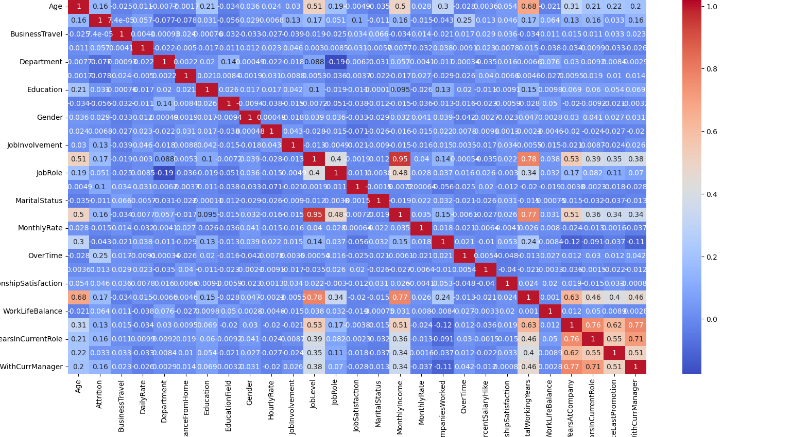
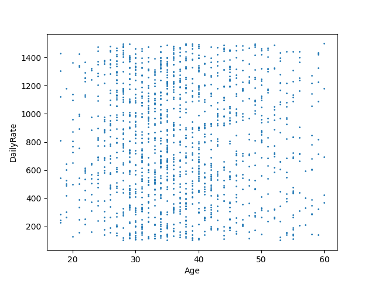
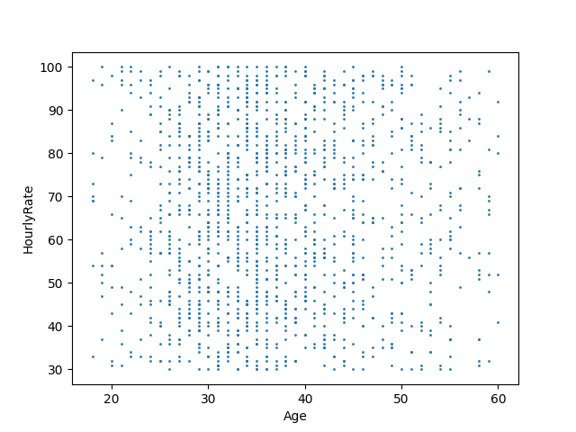
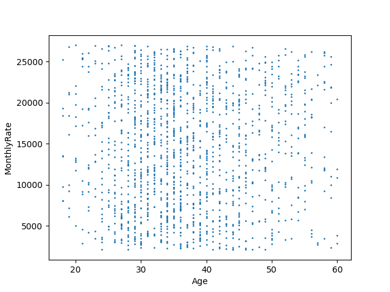
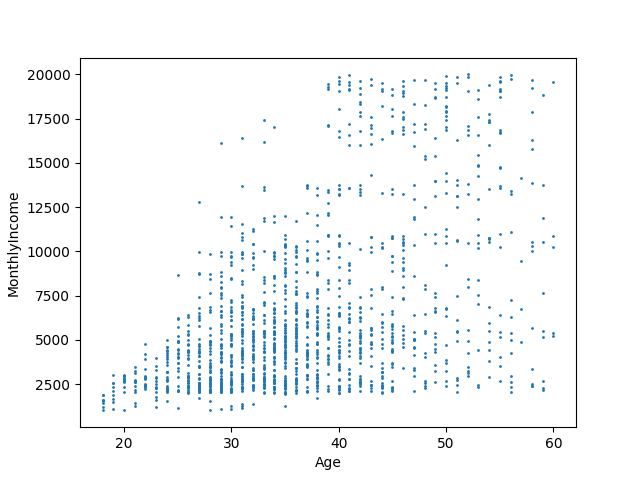
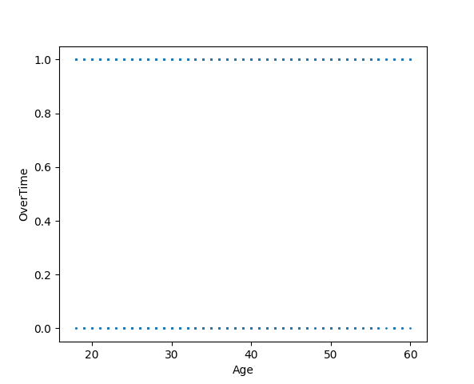
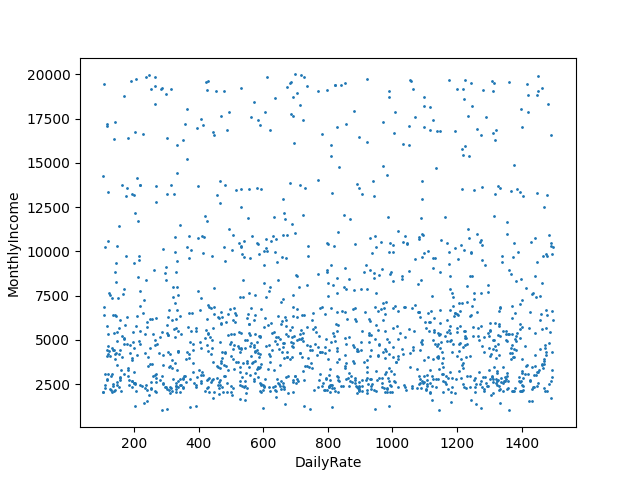

# Аналитика

---

## Корреляционная матрица

На данном графике представлена корреляция по всем параметрам. 

- сильная, или тесная при коэффициенте корреляции **corr** > 0,70
- средняя при 0,50 < **corr**| < 0,69
- умеренная при 0,30 < **corr**| < 0,49
- слабая при 0,20 < **corr** < 0,29
- очень слабая при **corr** < 0,19

Видно, что *JobLevel* сильно коррелирует с *MonthIncome*, а также с остальными.
Лично мне не очень понятно значение *JobLevel*, что затрудним объяснение результата
модели, поэтому его можно исключить.

Также сильно коррелируют последние 4 параметра. Ну оно и логично, так как они представляют собой 
стаж сотрудника в годах.

Однако почасовая, дневная и месячная нагрузка не коррелируют между собой.

---

## Графики

Интересно пронаблюдать, что почасовая, дневная и полумесячная нагрузка наиболее высокая у среднего 
поколения. Что логично, ведь у молодых мало знаний, опыта и навыком, а у старшего уже не так много сил.

Заметим, что переработки присутствуют среди всех возрастных групп.

Забавно видеть, как сильно разнятся зарплаты при одной и той же дневной нагрузке.
Что означает, что куда важнее трудиться с умом, чем просто трудиться.

